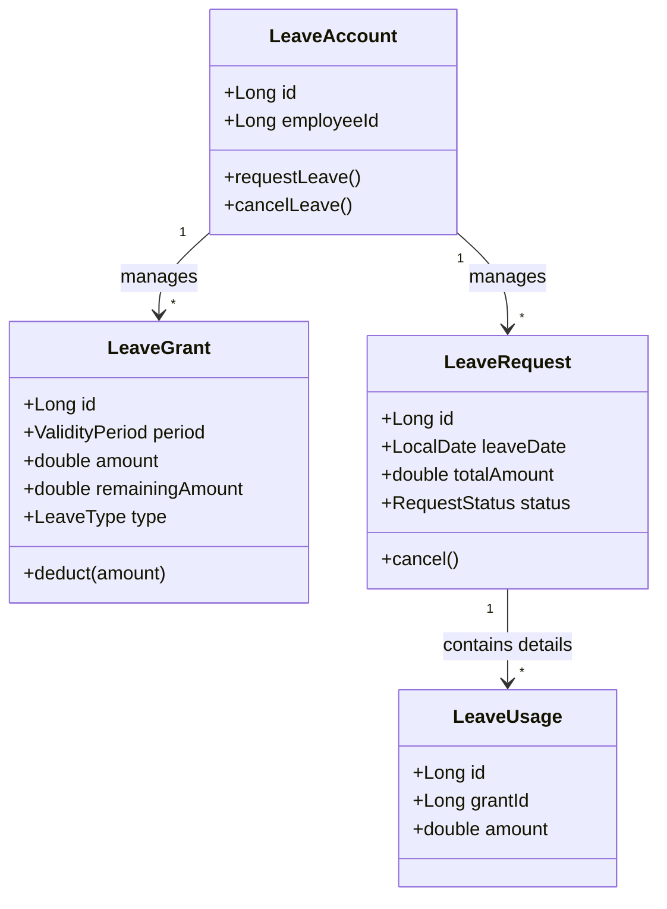

# Aggregate 정의 및 설계 (Tactical Design)

이 문서는 연차 도메인의 핵심 Aggregate 구조와 책임을 정의합니다.
초기 설계와 달리, **'신청(Request)'** 과 **'실제 차감 내역(Usage)'** 을 명확히 분리하여 유연성과 정합성을 확보했습니다.

---

## 1. Aggregate Overview (Mermaid)

---

## 2. Aggregate Root: `LeaveAccount` (연차 통장)
* **개념:** 한 직원의 모든 연차 자산과 거래 내역을 관리하는 최상위 엔티티.
* **책임:**
    1. **잔액 관리:** `Grant`들의 `remainingAmount` 총합을 관리.
    2. **트랜잭션 경계:** 신청 시 `Grant` 차감과 `Request` 생성을 하나의 트랜잭션으로 보장.

### 2.1 하위 엔티티 (Entities)

#### A. `LeaveGrant` (부여 내역)
* **개념:** 시스템(배치)이나 관리자에 의해 통장에 입금된 연차 자산.
* **주요 필드:**
    * `validityPeriod` (VO): 사용 가능 시작일(`effectiveDate`) ~ 만료일(`expirationDate`).
    * `remainingAmount`: 현재 잔액. (0.0이면 사용 완료)

#### B. `LeaveRequest` (연차 신청)
* **개념:** 사용자가 "쉬겠다"고 의사 표시를 한 내역. (비즈니스적 행위)
* **주요 필드:**
    * `leaveDate`: 실제 휴가일.
    * `totalAmount`: 신청한 총 일수 (예: 1.0).
    * `status`: `PENDING` -> `APPROVED` / `REJECTED` / `CANCELED`.
    * `usages`: 하위 `LeaveUsage` 리스트를 가짐.

#### C. `LeaveUsage` (차감 상세 내역 / Ledger)
* **개념:** 하나의 신청(`Request`)을 처리하기 위해 어떤 `Grant`에서 얼마를 가져다 썼는지 기록한 영수증.
* **주요 필드:**
    * `grantId`: 차감된 원천 Grant의 ID.
    * `amount`: 해당 Grant에서 차감한 일수.
* **역할:** 취소(Rollback) 시 "어디에 몇 개를 돌려줘야 하는지" 알려주는 근거 데이터.

---

## 3. 주요 비즈니스 로직 (Behavior)

### A. 연차 신청 (`requestLeave`)
1. **진입:** 사용자가 1.0일 휴가 신청.
2. **검증:** 잔여 연차 총합 확인.
3. **처리 (FIFO 차감):**
    * `LeaveRequest(1.0)` 생성.
    * 유효한 `Grant`들을 순회하며 차감.
        * `Grant A` (잔액 0.2) -> 0.2 차감 -> `LeaveUsage(GrantA, 0.2)` 생성.
        * `Grant B` (잔액 5.0) -> 0.8 차감 -> `LeaveUsage(GrantB, 0.8)` 생성.
    * `LeaveRequest`에 두 개의 `Usage`를 담고 저장.

### B. 연차 취소 (`cancelLeave`)
1. **진입:** 사용자가 신청했던 `LeaveRequest` 취소 요청.
2. **검증:** 이미 지난 날짜 등 취소 불가 사유 확인.
3. **처리 (Rollback):**
    * `LeaveRequest` 상태를 `CANCELED`로 변경.
    * 하위의 `LeaveUsage` 리스트를 순회.
    * 각 `Usage`에 기록된 `grantId`를 찾아가서 `amount`만큼 `remainingAmount`를 다시 더해줌(Refund).

---

## 4. 설계 검토 (Self-Review)

> **[Check Point]** 변경된 구조의 이점은?

* **명확한 책임 분리:** `Request`는 상태 관리만, `Usage`는 숫자 관리만 담당함.
* **취소 로직의 단순화:** `deductedGrantIds` 같은 모호한 리스트 대신, `Usage` 엔티티가 정확한 환불처를 가리키고 있음.
* **UI 친화적:** 사용자에게는 `LeaveRequest` 단위로 심플하게 보여줄 수 있음.