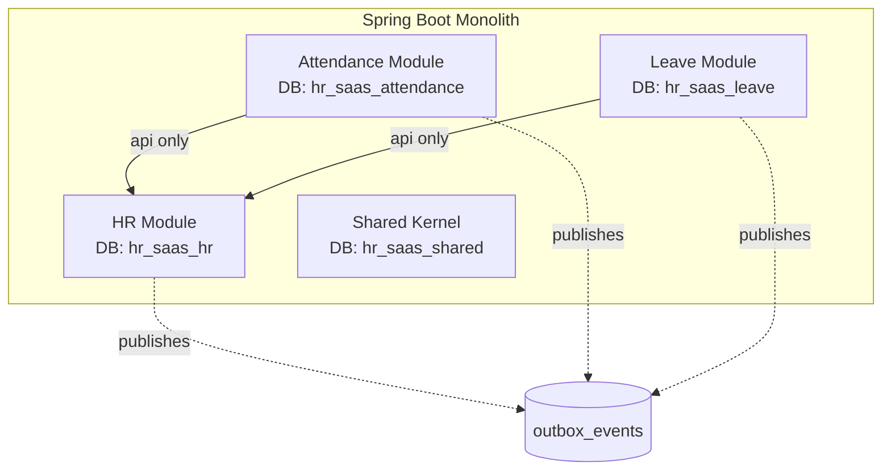

# HR SaaS 설계·구현 가이드

> 한국형 HR B2B SaaS를 모듈러 모놀리스로 설계·구현하며 블로그 시리즈를 발행하기 위한 문서.
> 코딩 에이전트와 **멘토링 모드**로 함께 구현하는 것을 전제로 작성되었다.

---

## 목차

1. [프로젝트 개요](#1-프로젝트-개요)
2. [도메인 모델](#2-도메인-모델)
3. [설계 철학과 핵심 의사결정](#3-설계-철학과-핵심-의사결정)
4. [기술 스택](#4-기술-스택)
5. [전체 Phase 로드맵](#5-전체-phase-로드맵)
6. [Phase 0 상세 구현 가이드](#6-phase-0-상세-구현-가이드)
7. [코딩 에이전트 멘토링 모드 가이드](#7-코딩-에이전트-멘토링-모드-가이드)
8. [블로그 시리즈 발행 계획](#8-블로그-시리즈-발행-계획)

---

## 1. 프로젝트 개요

### 만드는 것
한국 법·제도에 맞춘 **HR B2B SaaS**. 세 가지 핵심 모듈로 구성.

- **인사(HR)**: 조직·직원 마스터 데이터
- **근태(Attendance)**: 출퇴근·근무시간 관리
- **휴가(Leave)**: 연차·휴가 관리

### 해결하려는 문제
기존 HR SaaS는 기능 중심으로 쌓여 있어 **조직 계층(법인/사업자/사업장), 정책 상속, 발령 이력** 같은 한국 특화 요건을 유연하게 다루기 어렵다. 처음부터 **정책과 조직 계층을 일급 개념**으로 설계해 다양한 기업 구조에 대응한다.

### 사이드 프로젝트로서의 목표
1. 실무에 써먹을 수 있는 도메인/아키텍처 설계 역량 축적
2. Phase별 블로그 시리즈 발행 (검색 유입 + 포트폴리오)
3. 코딩 에이전트와의 협업 워크플로우 정립

---

## 2. 도메인 모델

### 조직 계층

```
법인(Corporation)
  └── 사업자(Business)           ← 사업자등록번호
        └── 사업장(Workplace)    ← 4대보험 사업장관리번호
              └── 부서(Department)
                    └── 직원(Employee)
```

| 계층 | 의미 | 식별 기준 |
|---|---|---|
| 법인 | 법적 실체. 그룹사 구조의 단위 | 법인등록번호 |
| 사업자 | 사업자등록 단위. 한 법인이 여러 사업자 보유 가능 | 사업자등록번호 |
| 사업장 | 4대보험·근로계약·취업규칙이 걸리는 물리/운영 단위 | 사업장관리번호 |
| 직원 | 특정 사업장에 소속. 발령으로 이동 가능 | 사번 |

### 세 모듈의 책임

**인사 (마스터 데이터 소유자, SSOT)**
- 직원 마스터(소속 사업장, 입퇴사, 근로계약)
- 조직도, 부서, 직급, 직책
- 발령 이력
- 정책 해석(Policy Resolver) — 다른 모듈이 조회

**근태**
- 출퇴근 기록, 실근로시간 집계
- 근무제 정책(사업장 단위) — 정시/유연/선택/교대
- 공휴일·회사휴일 달력(사업장별 상이)

**휴가**
- 연차 자동 부여(법정 + 회사 규정)
- 휴가 유형(연차·출산·육아·경조 등)
- 신청/결재/잔여 관리
- 근태와 양방향 연동

### 정책 적용 단위

정책(근무제·휴가 규정)은 **사업장 기본 + 부서/직군별 오버라이드** 구조.

```
Policy Resolution Chain (우선순위)
  1. 개인별 특약 (근로계약서 특이사항)
  2. 부서 오버라이드
  3. 직군 오버라이드
  4. 사업장 기본 정책
  5. 법인 템플릿 (fallback)
```

모든 정책은 `effective_from / effective_to`로 시행일 관리 → **과거 시점 재계산 가능**해야 함(소급 적용, 감사 대응).

---

## 3. 설계 철학과 핵심 의사결정

### 3-1. 모듈러 모놀리스 (Modular Monolith)

**선택:** 단일 애플리케이션 + 스키마 기반 모듈 분리

**왜:**
- MSA는 초기 생산성에 독약. 조직·인프라 준비 없이는 복잡도만 증가
- 하지만 그냥 모놀리스는 나중에 분리 불가
- 모듈러 모놀리스: **경계를 엄격히 유지하면서 단일 배포의 단순함**을 유지
- 필요시 모듈 단위로 서비스 추출 가능

**지키는 규율:**
1. 크로스 모듈 DB JOIN 금지
2. 외래키는 자기 스키마 내부만
3. 다른 모듈은 반드시 `api` 패키지 경유
4. 트랜잭션 경계는 모듈 내부까지만 (모듈 간은 최종 일관성)

### 3-2. 멀티테넌시: 하이브리드

**선택:** 기본은 공유 DB + `tenant_id` 격리, 대형 고객만 전용 DB로 분리

**왜:**
- 초기에는 테넌트 수가 적어 공유 DB가 운영·비용 효율적
- 대형사는 보안/성능/감사 요건으로 별도 DB 요구
- Tenant Router 패턴으로 전환 시점에 코드 변경 최소화

### 3-3. 모듈 경계: 복수 DATABASE (MySQL)

**선택:** 한 MySQL 인스턴스 안에 **네 개의 DATABASE** 생성

```
hr_saas_shared      ← 테넌트, Outbox, 공통 코드
hr_saas_hr          ← 인사 모듈
hr_saas_attendance  ← 근태 모듈
hr_saas_leave       ← 휴가 모듈
```

**왜:**
- MySQL에서 `SCHEMA = DATABASE`라 Postgres식 스키마 분리 개념이 없음
- 복수 DATABASE는 물리적 분리의 **드라이런** 역할
- InnoDB는 같은 인스턴스 내 cross-DB 트랜잭션 지원 → Outbox 동시 커밋 가능
- 나중에 분리 시 물리 이전이 쉬움

### 3-4. 이벤트: 동기 호출 우선 + Outbox 패턴

**선택:** 초기엔 직접 메서드 호출. 단, **Outbox 테이블은 Day 1부터 도입**.

**왜:**
- 이벤트 브로커(Kafka 등)를 처음부터 두면 운영 부담 과다
- 그러나 동기 호출만 쓰면 나중에 이벤트 전환이 지옥
- Outbox는 "상태 변경 = 이벤트 기록"을 강제하므로, 나중에 Publisher만 붙이면 전환 완료
- 도입 비용은 거의 0 (테이블 하나 + `INSERT` 한 줄)

### 3-5. SSOT(Single Source of Truth) = 인사 모듈

**선택:** 직원 기본 정보의 주인은 인사 모듈. 근태/휴가는 Read Model만 보유.

**왜:**
- 데이터 중복 시 "어디가 진실인지" 혼란 발생
- 상태 변경은 한 곳에서, 다른 모듈은 이벤트로 동기화
- 모듈 독립성과 조회 성능을 동시 확보 (CQRS 스타일)

### 3-6. PK 전략: UUIDv7 + BINARY(16)

**선택:** UUIDv7을 생성하고 MySQL에는 BINARY(16)으로 저장

**왜 UUIDv4가 아닌가:**
- InnoDB 테이블은 **PK 기준 clustered B+Tree**
- 랜덤 PK(UUIDv4)는 트리 여기저기에 삽입 → page split 폭증 → 캐시 파괴
- UUIDv7은 앞 48비트가 유닉스 밀리초 → 거의 항상 마지막 leaf에 append
- Secondary index는 PK를 값·키에 포함하므로 PK가 뚱뚱하면 모든 인덱스가 비대해짐

**왜 BINARY(16)인가:**
- VARCHAR(36)은 저장 공간 2배 이상 + 비교 비용 큼
- BINARY(16)은 UUID의 네이티브 크기

### 3-7. 정책 Resolution Chain

**선택:** 정책 해석 로직을 인사 모듈이 소유. 다른 모듈은 해석 결과만 받음.

**왜:**
- 정책 소스가 분산되면 해석 로직도 분산 → 버그 온상
- 인사 모듈이 "이 직원, 이 시점, 이 정책 종류 → 적용 값" 하나의 API 제공
- 해석 결과에 대한 단일 테스트 지점 확보

---

## 4. 기술 스택

| 영역 | 선택 | 버전 | 비고 |
|---|---|---|---|
| 언어 | Java | 21 | LTS, record·pattern matching 활용 |
| 프레임워크 | Spring Boot | 3.3.x | Jakarta 전환 완료 |
| 빌드 | Gradle | Kotlin DSL 또는 Groovy | 멀티모듈 |
| DB | MySQL | 8.4 | JSON 컬럼, UTF8MB4 |
| ORM | Spring Data JPA + Hibernate | 6.x | |
| 마이그레이션 | Flyway | 최신 | `flyway-mysql` 포함 |
| ID 생성 | uuid-creator | 6.0.0 | UUIDv7 |
| 테스트 | JUnit 5 + Testcontainers | | MySQL 컨테이너 |
| 경계 검사 | ArchUnit | 1.3.x | 모듈 경계 강제 |
| 보조 라이브러리 | Lombok, Jackson JSR310 | | |
| CI | GitHub Actions | | Testcontainers 지원 |

---

## 5. 전체 Phase 로드맵

| Phase | 목표 | 예상 기간(사이드 기준) | 주요 산출물 |
|---|---|---|---|
| **0** | 기반공사 (스켈레톤) | 1.5~2주 | 모듈 구조, Outbox, 경계 강제, 직원 1명 등록 E2E |
| **1** | 테넌트 + 조직 계층 | 2~3주 | 법인/사업자/사업장 CRUD, Tenant Router |
| **2** | 인사 마스터 | 3~4주 | 직원·조직도·발령 이력, 이벤트 인터페이스 확정 |
| **3** | 휴가 MVP | 3~4주 | 연차 자동 부여, 신청/결재, Outbox 구독 첫 검증 |
| **4** | 근태 MVP | 4~5주 | 출퇴근, 집계, 휴가→근태 연동 (Saga 첫 적용) |
| **5** | 정책 오버라이드 + 연동 완성 | 3~4주 | Policy Resolver, 개근율 기반 연차, 근무제 다종 |
| **6** | 확장 | 지속 | DB 분리 옵션, Kafka 전환, 외부 연계 |

### Phase별 간략 설명

**Phase 0 — 기반공사**
뼈대만 세우는 단계. 기능 0%, 구조 100%. 여기서 타협하면 이후 전부 무너진다.
- 모듈 경계(ArchUnit), Outbox, 멀티테넌시, CI — 네 기둥을 Day 1에 박는다.

**Phase 1 — 테넌트 + 조직 계층**
법인·사업자·사업장 3계층 데이터 모델 도입. 로그인 시 법인 컨텍스트 결정.

**Phase 2 — 인사 마스터 ⭐️**
SSOT 확립. `EmployeeService` API와 도메인 이벤트(`EmployeeJoined`, `EmployeeTransferred` 등) 확정. 여기서 API가 깔끔해야 Phase 3·4가 쉬워진다.

**Phase 3 — 휴가 MVP**
근태보다 먼저 하는 이유: 로직이 단순해서 **모듈 간 연동 패턴을 검증하기에 적합**. 연차 자동 부여는 입사일 기준 단순 로직으로 시작.

**Phase 4 — 근태 MVP**
가장 복잡한 모듈. 근무제/집계/예외 케이스. 휴가와 양방향 연동하며 Saga 패턴 첫 적용.

**Phase 5 — 정책 고도화**
Policy Resolution Chain 구현. 사업장 → 직군 → 부서 → 개인 오버라이드. 시행일 기반 정책 관리.

**Phase 6 — 확장**
대형사용 DB 분리, Kafka 이벤트 전환, 외부 시스템 연계(급여, 전자결재, ESS 앱).

### Phase 간 공통 원칙

- 각 Phase 시작 전 **인터페이스 계약**부터 합의 → 구현
- 각 Phase 종료 시 **블로그 초안 작성** (기억이 생생할 때)
- 마이그레이션은 **Flyway만**, 롤백 스크립트 금지 (forward-only)
- 테스트 먼저 아니라 **테스트 적어도 같이** (Testcontainers 필수)

---

## 6. Phase 0 상세 구현 가이드

### 목표
**기능 0%, 구조 100%**. 직원 1명 등록하면 Outbox에 이벤트가 떨어지는 것까지 E2E로 동작.

### 완료 체크리스트
- [ ] `./gradlew build` 통과
- [ ] `docker compose up` 후 앱 정상 기동
- [ ] 4개 DATABASE 자동 생성됨
- [ ] `POST /api/employees` 성공, BINARY(16) PK로 저장
- [ ] `outbox_events`에 `EmployeeCreated` 레코드 존재
- [ ] Testcontainers 통합 테스트 초록불
- [ ] ArchUnit 규칙 5개 초록불
- [ ] **의도적 위반 브랜치에서 CI 빨간불 스크린샷 확보** 🎯
- [ ] README에 Mermaid 아키텍처 다이어그램
- [ ] GitHub Actions CI 초록 배지

### 최종 디렉토리 구조

```
hr-saas/
├── docker-compose.yml
├── settings.gradle
├── build.gradle
├── app/
│   └── src/
│       ├── main/
│       │   ├── java/com/example/hrsaas/HrSaasApplication.java
│       │   └── resources/
│       │       ├── application.yml
│       │       └── db/migration/{shared,hr,attendance,leave}/V*.sql
│       └── test/java/.../ArchitectureTest.java
├── shared-kernel/
│   └── src/main/java/com/example/hrsaas/shared/
│       ├── id/Ids.java
│       ├── tenant/{TenantContext,TenantFilter}.java
│       ├── event/DomainEvent.java
│       ├── outbox/OutboxWriter.java
│       ├── correlation/CorrelationContext.java
│       └── persistence/UuidToBinaryConverter.java
└── modules/
    ├── hr/src/main/java/.../hr/
    │   ├── api/{EmployeeService, CreateEmployeeCommand, event/EmployeeCreated}
    │   ├── domain/Employee.java
    │   └── infrastructure/{EmployeeRepository, EmployeeServiceImpl, EmployeeController}
    ├── attendance/   (빈 껍데기)
    └── leave/        (빈 껍데기)
```

### STEP 1 — Gradle 멀티모듈 스캐폴딩

**settings.gradle**
```groovy
rootProject.name = 'hr-saas'
include 'app', 'shared-kernel'
include 'modules:hr', 'modules:attendance', 'modules:leave'
```

**루트 build.gradle**
```groovy
plugins {
    id 'java' apply false
    id 'org.springframework.boot' version '3.3.4' apply false
    id 'io.spring.dependency-management' version '1.1.6' apply false
}

subprojects {
    apply plugin: 'java'
    apply plugin: 'io.spring.dependency-management'

    java {
        toolchain { languageVersion = JavaLanguageVersion.of(21) }
    }

    repositories { mavenCentral() }

    dependencyManagement {
        imports {
            mavenBom 'org.springframework.boot:spring-boot-dependencies:3.3.4'
        }
    }

    dependencies {
        compileOnly 'org.projectlombok:lombok'
        annotationProcessor 'org.projectlombok:lombok'
        testImplementation 'org.springframework.boot:spring-boot-starter-test'
        testCompileOnly 'org.projectlombok:lombok'
        testAnnotationProcessor 'org.projectlombok:lombok'
    }

    test { useJUnitPlatform() }
}
```

**shared-kernel/build.gradle**
```groovy
dependencies {
    implementation 'org.springframework.boot:spring-boot-starter'
    implementation 'org.springframework.boot:spring-boot-starter-jdbc'
    implementation 'org.springframework.boot:spring-boot-starter-web'
    implementation 'com.fasterxml.jackson.datatype:jackson-datatype-jsr310'
    implementation 'com.github.f4b6a5:uuid-creator:6.0.0'
}
```

**modules/hr/build.gradle**
```groovy
dependencies {
    implementation project(':shared-kernel')
    implementation 'org.springframework.boot:spring-boot-starter-data-jpa'
    implementation 'org.springframework.boot:spring-boot-starter-web'
}
```

**app/build.gradle**
```groovy
plugins { id 'org.springframework.boot' }

dependencies {
    implementation project(':shared-kernel')
    implementation project(':modules:hr')
    implementation project(':modules:attendance')
    implementation project(':modules:leave')

    implementation 'org.springframework.boot:spring-boot-starter-web'
    implementation 'org.springframework.boot:spring-boot-starter-data-jpa'
    implementation 'org.flywaydb:flyway-core'
    implementation 'org.flywaydb:flyway-mysql'
    runtimeOnly 'com.mysql:mysql-connector-j'

    testImplementation 'com.tngtech.archunit:archunit-junit5:1.3.0'
    testImplementation 'org.testcontainers:mysql:1.20.1'
    testImplementation 'org.testcontainers:junit-jupiter:1.20.1'
}
```

**체크:** `./gradlew build` 통과.

### STEP 2 — MySQL 기동

**docker-compose.yml**
```yaml
services:
  mysql:
    image: mysql:8.4
    environment:
      MYSQL_ROOT_PASSWORD: root
      MYSQL_USER: dev
      MYSQL_PASSWORD: dev
      MYSQL_DATABASE: hr_saas_shared
    ports: ["3306:3306"]
    command:
      - --character-set-server=utf8mb4
      - --collation-server=utf8mb4_0900_ai_ci
```

**체크:** `docker compose up -d` → `mysql -h 127.0.0.1 -udev -pdev` 접속 확인.

### STEP 3 — shared-kernel 핵심 구성요소

**3-1. UUIDv7 생성기**
```java
// shared-kernel: com.example.hrsaas.shared.id.Ids
public final class Ids {
    private Ids() {}
    public static UUID newId() {
        return UuidCreator.getTimeOrderedEpoch(); // UUIDv7
    }
}
```

**3-2. UUID ↔ BINARY(16) 컨버터**
```java
// shared-kernel: ...shared.persistence.UuidToBinaryConverter
@Converter(autoApply = true)
public class UuidToBinaryConverter implements AttributeConverter<UUID, byte[]> {
    @Override public byte[] convertToDatabaseColumn(UUID uuid) {
        if (uuid == null) return null;
        ByteBuffer bb = ByteBuffer.allocate(16);
        bb.putLong(uuid.getMostSignificantBits());
        bb.putLong(uuid.getLeastSignificantBits());
        return bb.array();
    }
    @Override public UUID convertToEntityAttribute(byte[] b) {
        if (b == null) return null;
        ByteBuffer bb = ByteBuffer.wrap(b);
        return new UUID(bb.getLong(), bb.getLong());
    }
    public static byte[] toBytes(UUID u) {
        return new UuidToBinaryConverter().convertToDatabaseColumn(u);
    }
}
```

**3-3. TenantContext + 필터**
```java
// shared-kernel: ...shared.tenant.TenantContext
public final class TenantContext {
    private static final ThreadLocal<UUID> HOLDER = new ThreadLocal<>();
    public static void set(UUID id) { HOLDER.set(id); }
    public static UUID require() {
        UUID id = HOLDER.get();
        if (id == null) throw new IllegalStateException("Tenant not set");
        return id;
    }
    public static void clear() { HOLDER.remove(); }
}

// shared-kernel: ...shared.tenant.TenantFilter
@Component
public class TenantFilter extends OncePerRequestFilter {
    @Override
    protected void doFilterInternal(HttpServletRequest req, HttpServletResponse res, FilterChain chain)
            throws ServletException, IOException {
        String header = req.getHeader("X-Tenant-Id");
        if (header == null) { res.sendError(400, "Missing X-Tenant-Id"); return; }
        try {
            TenantContext.set(UUID.fromString(header));
            chain.doFilter(req, res);
        } finally {
            TenantContext.clear();
        }
    }
}
```

**3-4. CorrelationContext**
```java
// shared-kernel: ...shared.correlation.CorrelationContext
public final class CorrelationContext {
    private static final ThreadLocal<UUID> HOLDER = new ThreadLocal<>();
    public static UUID current() {
        UUID id = HOLDER.get();
        if (id == null) { id = Ids.newId(); HOLDER.set(id); }
        return id;
    }
    public static void clear() { HOLDER.remove(); }
}
```

**3-5. DomainEvent + OutboxWriter**
```java
// shared-kernel: ...shared.event.DomainEvent
public interface DomainEvent {
    String aggregateType();
    String aggregateId();
    String eventType();
}

// shared-kernel: ...shared.outbox.OutboxWriter
@Component
@RequiredArgsConstructor
public class OutboxWriter {
    private final JdbcTemplate jdbc;
    private final ObjectMapper mapper;

    @Transactional(propagation = Propagation.MANDATORY)
    public void append(UUID tenantId, DomainEvent event) {
        try {
            jdbc.update("""
                INSERT INTO hr_saas_shared.outbox_events
                  (id, tenant_id, aggregate_type, aggregate_id, event_type, payload, correlation_id)
                VALUES (?, ?, ?, ?, ?, CAST(? AS JSON), ?)
                """,
                UuidToBinaryConverter.toBytes(Ids.newId()),
                UuidToBinaryConverter.toBytes(tenantId),
                event.aggregateType(),
                event.aggregateId(),
                event.eventType(),
                mapper.writeValueAsString(event),
                UuidToBinaryConverter.toBytes(CorrelationContext.current())
            );
        } catch (JsonProcessingException e) {
            throw new IllegalStateException(e);
        }
    }
}
```

**핵심 포인트**
- `Propagation.MANDATORY`: Outbox는 반드시 **기존 트랜잭션 안에서만** 써야 함
- ObjectMapper에 `JavaTimeModule` 등록 필요 (앱 설정에서)

### STEP 4 — Flyway로 복수 DATABASE 초기화

**application.yml**
```yaml
spring:
  datasource:
    url: jdbc:mysql://localhost:3306/hr_saas_shared?createDatabaseIfNotExist=true&serverTimezone=UTC
    username: dev
    password: dev
    driver-class-name: com.mysql.cj.jdbc.Driver
  jpa:
    hibernate.ddl-auto: validate
    properties:
      hibernate.dialect: org.hibernate.dialect.MySQLDialect
      hibernate.format_sql: true
  flyway:
    enabled: false   # 수동 Config로 4개 DB에 각각 적용
  jackson:
    serialization.write-dates-as-timestamps: false
```

**FlywayConfig**
```java
// app: com.example.hrsaas.config.FlywayConfig
@Configuration
public class FlywayConfig {

    @Bean
    public FlywayMigrationInitializer migrate(DataSource dataSource) {
        migrateOne(dataSource, "hr_saas_shared",     "classpath:db/migration/shared");
        migrateOne(dataSource, "hr_saas_hr",         "classpath:db/migration/hr");
        migrateOne(dataSource, "hr_saas_attendance", "classpath:db/migration/attendance");
        migrateOne(dataSource, "hr_saas_leave",      "classpath:db/migration/leave");
        return new FlywayMigrationInitializer(
            Flyway.configure().dataSource(dataSource).load(), f -> {}
        );
    }

    private void migrateOne(DataSource ds, String schema, String location) {
        Flyway.configure()
            .dataSource(ds)
            .schemas(schema)          // MySQL에선 DATABASE 생성
            .createSchemas(true)
            .locations(location)
            .load()
            .migrate();
    }
}
```

**마이그레이션 SQL**

`app/src/main/resources/db/migration/shared/V1__outbox_and_tenant.sql`
```sql
CREATE TABLE tenant (
    id BINARY(16) PRIMARY KEY,
    name VARCHAR(200) NOT NULL,
    created_at DATETIME(6) NOT NULL DEFAULT CURRENT_TIMESTAMP(6)
) ENGINE=InnoDB;

CREATE TABLE outbox_events (
    id BINARY(16) PRIMARY KEY,
    tenant_id BINARY(16) NOT NULL,
    aggregate_type VARCHAR(100) NOT NULL,
    aggregate_id VARCHAR(100) NOT NULL,
    event_type VARCHAR(100) NOT NULL,
    payload JSON NOT NULL,
    occurred_at DATETIME(6) NOT NULL DEFAULT CURRENT_TIMESTAMP(6),
    published_at DATETIME(6) NULL,
    correlation_id BINARY(16) NULL,
    KEY idx_unpublished (published_at, occurred_at)
) ENGINE=InnoDB;
```

`db/migration/hr/V1__employee.sql`
```sql
CREATE TABLE employee (
    id BINARY(16) PRIMARY KEY,
    tenant_id BINARY(16) NOT NULL,
    name VARCHAR(100) NOT NULL,
    email VARCHAR(200) NOT NULL,
    hired_at DATE NOT NULL,
    created_at DATETIME(6) NOT NULL DEFAULT CURRENT_TIMESTAMP(6),
    KEY idx_tenant (tenant_id)
) ENGINE=InnoDB;
```

`db/migration/attendance/V1__init.sql`, `db/migration/leave/V1__init.sql` — 빈 로케이션을 피하기 위한 더미 파일이라도 둘 것.

**체크:** 앱 기동 → `SHOW DATABASES;`로 4개 DB 생성 확인.

### STEP 5 — 인사 모듈 최소 구현

**api 패키지 (외부 공개)**
```java
public interface EmployeeService {
    UUID create(CreateEmployeeCommand cmd);
}

public record CreateEmployeeCommand(String name, String email, LocalDate hiredAt) {}

public record EmployeeCreated(
    String aggregateId, String name, String email, LocalDate hiredAt
) implements DomainEvent {
    @Override public String aggregateType() { return "Employee"; }
    @Override public String eventType() { return "EmployeeCreated"; }
}
```

**domain (내부)**
```java
@Entity
@Table(catalog = "hr_saas_hr", name = "employee")
@Getter
@NoArgsConstructor(access = AccessLevel.PROTECTED)
public class Employee {
    @Id private UUID id;
    @Column(name = "tenant_id", nullable = false) private UUID tenantId;
    @Column(nullable = false, length = 100) private String name;
    @Column(nullable = false, length = 200) private String email;
    @Column(name = "hired_at", nullable = false) private LocalDate hiredAt;

    public static Employee create(UUID tenantId, String name, String email, LocalDate hiredAt) {
        Employee e = new Employee();
        e.id = Ids.newId();
        e.tenantId = tenantId;
        e.name = name;
        e.email = email;
        e.hiredAt = hiredAt;
        return e;
    }
}
```

**infrastructure (내부)**
```java
public interface EmployeeRepository extends JpaRepository<Employee, UUID> {}

@Service
@RequiredArgsConstructor
public class EmployeeServiceImpl implements EmployeeService {
    private final EmployeeRepository repo;
    private final OutboxWriter outbox;

    @Override
    @Transactional
    public UUID create(CreateEmployeeCommand cmd) {
        UUID tenantId = TenantContext.require();
        Employee e = Employee.create(tenantId, cmd.name(), cmd.email(), cmd.hiredAt());
        repo.save(e);
        outbox.append(tenantId, new EmployeeCreated(
            e.getId().toString(), e.getName(), e.getEmail(), e.getHiredAt()
        ));
        return e.getId();
    }
}

@RestController
@RequestMapping("/api/employees")
@RequiredArgsConstructor
public class EmployeeController {
    private final EmployeeService service;

    @PostMapping
    public Map<String, UUID> create(@RequestBody CreateEmployeeCommand cmd) {
        return Map.of("id", service.create(cmd));
    }
}
```

**앱 진입점**
```java
@SpringBootApplication
@EnableJpaRepositories(basePackages = "com.example.hrsaas")
@EntityScan(basePackages = "com.example.hrsaas")
@ComponentScan(basePackages = "com.example.hrsaas")
public class HrSaasApplication {
    public static void main(String[] args) {
        SpringApplication.run(HrSaasApplication.class, args);
    }

    @Bean ObjectMapper objectMapper() {
        return new ObjectMapper().registerModule(new JavaTimeModule());
    }
}
```

**체크:**
```bash
curl -X POST http://localhost:8080/api/employees \
  -H "Content-Type: application/json" \
  -H "X-Tenant-Id: 11111111-1111-1111-1111-111111111111" \
  -d '{"name":"홍길동","email":"hong@test.com","hiredAt":"2025-01-15"}'
```
```sql
SELECT * FROM hr_saas_hr.employee;
SELECT event_type FROM hr_saas_shared.outbox_events;  -- 'EmployeeCreated'
```

### STEP 6 — ArchUnit으로 경계 강제 🎯

**오프너 블로그 글의 하이라이트가 될 부분.** 의도적 위반 PR에서 CI가 빨갛게 터지는 스크린샷이 핵심 자산.

```java
@AnalyzeClasses(packages = "com.example.hrsaas", importOptions = DoNotIncludeTests.class)
class ArchitectureTest {

    @ArchTest
    static final ArchRule hr_domain은_외부에서_접근_금지 =
        noClasses().that().resideOutsideOfPackage("..hr..")
            .should().dependOnClassesThat().resideInAPackage("..hr.domain..")
            .because("HR domain 내부는 api 패키지를 통해서만 접근해야 함");

    @ArchTest
    static final ArchRule hr_infrastructure는_외부에서_접근_금지 =
        noClasses().that().resideOutsideOfPackage("..hr..")
            .should().dependOnClassesThat().resideInAPackage("..hr.infrastructure..");

    @ArchTest
    static final ArchRule attendance_domain_내부_격리 =
        noClasses().that().resideOutsideOfPackage("..attendance..")
            .should().dependOnClassesThat().resideInAPackage("..attendance.domain..");

    @ArchTest
    static final ArchRule leave_domain_내부_격리 =
        noClasses().that().resideOutsideOfPackage("..leave..")
            .should().dependOnClassesThat().resideInAPackage("..leave.domain..");

    @ArchTest
    static final ArchRule 모듈간_순환의존_금지 =
        slices().matching("..modules.(*)..").should().beFreeOfCycles();

    @ArchTest
    static final ArchRule Repository는_같은_모듈_내에서만_사용 =
        classes().that().haveSimpleNameEndingWith("Repository")
            .should().onlyBeAccessed().byClassesThat()
            .resideInAnyPackage("..infrastructure..", "..domain..");
}
```

**체크:** `./gradlew :app:test` 통과. 일부러 `AttendanceSomething`에서 `EmployeeRepository`를 import해서 CI가 터지는지 확인. **스크린샷 확보.**

### STEP 7 — Testcontainers 통합 테스트

```java
@SpringBootTest
@Testcontainers
class EmployeeCreationIntegrationTest {

    @Container
    static MySQLContainer<?> mysql = new MySQLContainer<>("mysql:8.4")
        .withDatabaseName("hr_saas_shared")
        .withUsername("dev")
        .withPassword("dev");

    @DynamicPropertySource
    static void props(DynamicPropertyRegistry r) {
        r.add("spring.datasource.url", () ->
            mysql.getJdbcUrl() + "?createDatabaseIfNotExist=true");
        r.add("spring.datasource.username", mysql::getUsername);
        r.add("spring.datasource.password", mysql::getPassword);
    }

    @Autowired EmployeeService service;
    @Autowired JdbcTemplate jdbc;

    @Test
    void 직원_등록시_Outbox에_이벤트가_기록된다() {
        TenantContext.set(Ids.newId());
        try {
            service.create(new CreateEmployeeCommand(
                "홍길동", "hong@test.com", LocalDate.now()
            ));
            Long count = jdbc.queryForObject(
                "SELECT COUNT(*) FROM hr_saas_shared.outbox_events " +
                "WHERE event_type = 'EmployeeCreated'",
                Long.class
            );
            assertThat(count).isEqualTo(1L);
        } finally {
            TenantContext.clear();
        }
    }
}
```

**체크:** 이 테스트가 녹색이면 Phase 0 v0.1 완성.

### STEP 8 — GitHub Actions CI

`.github/workflows/ci.yml`
```yaml
name: CI
on: [push, pull_request]
jobs:
  test:
    runs-on: ubuntu-latest
    steps:
      - uses: actions/checkout@v4
      - uses: actions/setup-java@v4
        with:
          distribution: temurin
          java-version: 21
      - uses: gradle/actions/setup-gradle@v4
      - run: ./gradlew build --no-daemon
```

### STEP 9 — README + 아키텍처 다이어그램

````markdown
# hr-saas

## Architecture



## 설계 원칙
- 모듈 간 경계는 ArchUnit으로 강제
- 크로스 DB JOIN 금지
- 모든 상태 변경은 Outbox에 이벤트 기록
- PK는 UUIDv7 / BINARY(16)
````

### Phase 0 페이싱 (사이드 기준)

| Day | 작업 |
|---|---|
| 1~2 | STEP 1~2 (프로젝트 + MySQL) |
| 3~4 | STEP 3 (shared-kernel 전체) |
| 5 | STEP 4 (Flyway) |
| 6~8 | STEP 5 (HR 모듈) |
| 9~10 | STEP 6 (ArchUnit) — 가장 공들일 부분 |
| 11 | STEP 7~8 (테스트 + CI) |
| 12~14 | STEP 9 + 블로그 초안 |

---

## 7. 코딩 에이전트 멘토링 모드 가이드

### 기본 원칙

이 프로젝트는 **생산성보다 학습**이 우선. 에이전트는 코드를 완성해주는 도구가 아니라, 함께 생각하는 파트너여야 한다.

### 에이전트에게 요청할 멘토링 방식

1. **"왜"를 항상 설명하기**
   - 단순히 "이렇게 쓰세요"가 아니라 "이렇게 쓰는 이유는 ~이고, 대안은 ~인데 ~라서 이것을 택한다"
   - 트레이드오프를 명시

2. **작은 단위로 진행**
   - 한 번에 한 파일, 한 기능
   - 각 단계마다 체크포인트 (앱 기동, 테스트 통과 등)

3. **함정 선제 경고**
   - "이 단계에서 흔히 놓치는 것: ...", "이렇게 했다가 망하는 케이스: ..."
   - 특히 Spring Boot 3 / Hibernate 6 / MySQL 바인딩 이슈

4. **직접 타이핑 구간 남기기**
   - 핵심 로직(OutboxWriter, ArchUnit 규칙, Service 구현 등)은 내가 직접 타이핑
   - 에이전트는 보조·리뷰

5. **디버깅 먼저, 해답 나중**
   - 에러가 나면 "뭐가 문제일지 추론해봐" → 내가 시도 → 막히면 힌트
   - 한 방에 정답 주지 않기

### 세션 시작 시 에이전트에게 줄 컨텍스트

```
나는 이 HR SaaS 프로젝트를 학습 목적으로 진행 중이다.
현재 Phase [N], STEP [M]을 구현 중이다.
멘토링 모드로 부탁한다:
  - "왜"를 항상 설명
  - 대안과 트레이드오프 제시
  - 한 번에 한 단위
  - 함정 선제 경고
  - 디버깅은 힌트부터
이 가이드 문서(hr-saas-guide.md)를 기준으로 진행한다.
```

### 블로그 기록 포인트 (에이전트에게 수집 요청)

진행하면서 에이전트에게 다음을 노트로 누적시켜 달라고 부탁:

- **의사결정 로그**: 이 시점에 뭘 고민했고 왜 이 선택을 했는지
- **함정 로그**: 실제로 걸려 넘어진 이슈와 해결 과정 (블로그 금광)
- **이해 전/후**: "처음엔 X로 생각했는데 알고 보니 Y였다" 패턴
- **벤치/수치**: 만약 성능 관련 결정이 있었다면 수치 근거
- **대안 검토**: 채택하지 않은 길과 그 이유

각 Phase 종료 시 이 노트를 모아 블로그 초안의 재료로 사용.

---

## 8. 블로그 시리즈 발행 계획

### 시리즈 오프너 (Phase 0 종료 시)

**제목 후보:** "HR SaaS를 모듈러 모놀리스로 시작한 이유"

**구조:**
1. 도입 — 왜 HR SaaS인가, 어떤 선택지가 있었나
2. MSA를 안 한 이유
3. 그냥 모놀리스도 아닌 이유 → 모듈러 모놀리스
4. **경계를 말이 아닌 코드로 강제하는 법** (ArchUnit + CI 스크린샷) ← 하이라이트
5. Outbox를 Day 1부터 둔 이유
6. 시리즈에서 다룰 것들 (티저)

### Phase별 주제 풀

**Phase 0 — 기반공사 (3~4편)**
- 모듈러 모놀리스를 선택한 이유 (오프너)
- 단일 DB에서 복수 DATABASE로 모듈 경계 긋기
- Outbox 패턴을 Day 1부터 도입한 이유
- 멀티테넌시 아키텍처 3가지 비교와 하이브리드 선택

**Phase 1 — 테넌트/조직 (2편)**
- 한국형 HR의 법인·사업자·사업장, 왜 3계층인가
- Tenant Router 구현기

**Phase 2 — 인사 마스터 (3편)**
- 발령 이력을 어떻게 모델링했나 (effective date)
- 조직도를 DB로 표현하는 3가지 방법
- SSOT로서의 인사 모듈 — 이벤트 인터페이스 설계

**Phase 3 — 휴가 (3편)**
- 근기법 기반 연차 자동 부여 로직 구현기 👑
- 입사일 기준 vs 회계연도 기준 연차 관리
- 휴가 결재 워크플로우 — 첫 모듈 간 연동기

**Phase 4 — 근태 (3편)**
- 근무제 4종 모델링: 정시·유연·선택·교대
- Saga 패턴으로 휴가-근태 연동하기
- 근태 집계 로직의 함정들

**Phase 5 — 정책 고도화 (2편)**
- Policy Resolution Chain 구현기
- 시행일 기반 정책 관리

**Phase 6 — 확장 (2편)**
- 모놀리스에서 MSA로: Outbox가 우리를 구한 순간
- 테넌트 DB 분리 마이그레이션 실전

### 횡단 주제 (번외편)

- MySQL에서 UUIDv4를 쓰면 생기는 일 — UUIDv7로 바꾸고 벤치마크한 기록 👑
- InnoDB의 B+Tree 구조로 이해하는 PK 선택
- 4대보험·근기법이 소프트웨어 설계에 미치는 영향 👑
- 개인정보 처리 — HR SaaS의 숙명
- B2B SaaS 권한 모델: 법인 관리자 vs 사업장 관리자

### 작성 팁

- **Phase 완료 시점에 작성.** 진행 중엔 메모만
- **"왜 안 했나"도 쓰기** (배제 결정이 의외로 귀함)
- **코드 스니펫 + 다이어그램(Mermaid)** 필수
- **한국 법령 근거 인용** (연차, 4대보험 조항)
- **실패담 한 편**은 꼭 포함 (시리즈가 살아있음을 증명)

---

## 부록: 자주 막히는 지점 (예상)

| 문제 | 해결 힌트 |
|---|---|
| Spring Boot 3에서 `@Table(catalog=...)` 동작 | Hibernate 6의 dialect + `spring.jpa.properties.hibernate.default_catalog` 대신 엔티티별 `catalog` 지정 |
| MySQL JSON 컬럼 바인딩 | `CAST(? AS JSON)` 명시. 또는 `JsonType` 사용 |
| Testcontainers가 IDE에서 느림 | `testcontainers.reuse.enable=true` 설정 |
| ArchUnit이 Gradle 멀티모듈에서 클래스 못 찾음 | `@AnalyzeClasses`의 `packages` 루트 범위 확인 |
| BINARY(16) 쿼리 시 눈으로 읽기 힘듦 | `HEX(id)` 또는 MySQL의 `BIN_TO_UUID()` 함수 |
| Flyway가 빈 로케이션에서 에러 | 더미 `V1__init.sql` 배치 |

---

## 변경 이력

| 날짜 | 버전 | 변경 내용 |
|---|---|---|
| 2026-04-20 | 0.1 | 초안 작성 — Phase 0 상세 + 전체 Phase 개요 |
