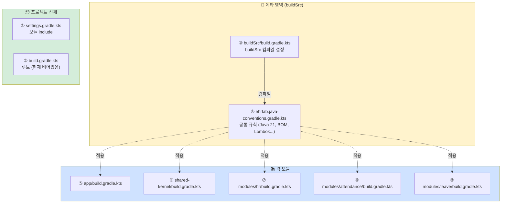
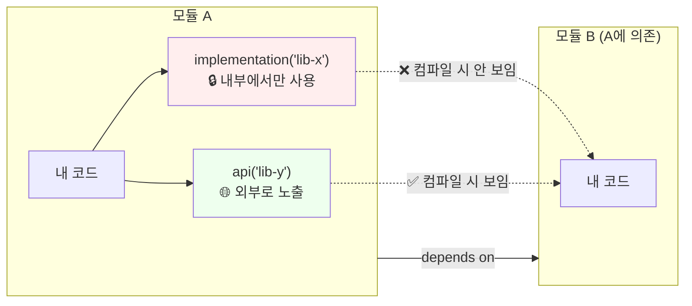
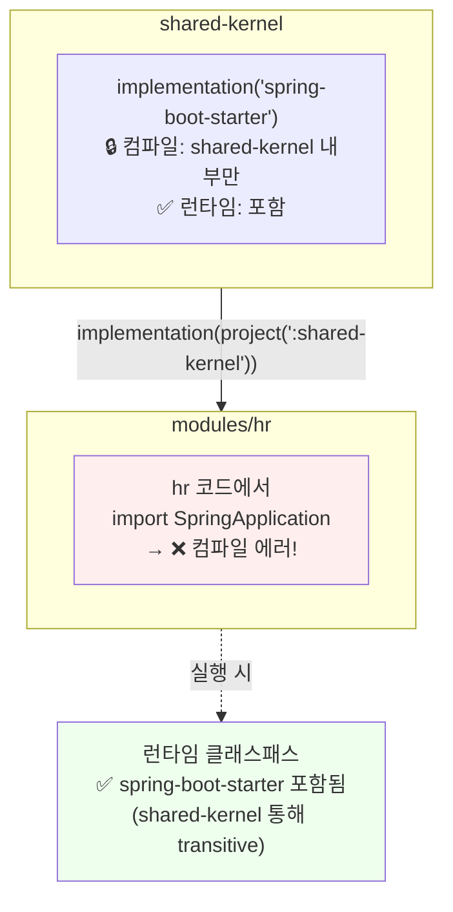
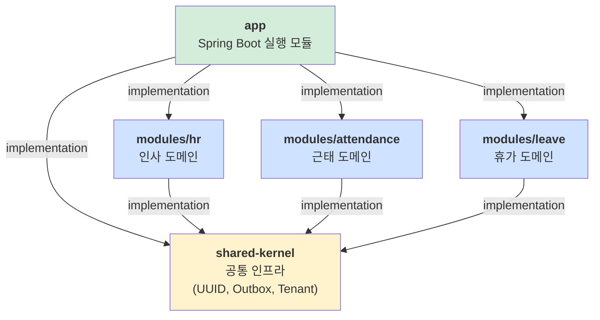

# Gradle 멀티모듈 의존성 가이드

> Gradle Kotlin DSL 멀티모듈 프로젝트의 파일 구조와 의존성 키워드 정리.
> e-hr-lab 프로젝트 구조 기준. 처음 배우는 사람이 헷갈리는 포인트 중심.

## 목차

1. [전체 파일 지도](#1-전체-파일-지도)
2. [각 파일의 역할](#2-각-파일의-역할)
3. [의존성 키워드 3종](#3-의존성-키워드-3종)
4. [컴파일 가시성 vs 런타임 포함](#4-컴파일-가시성-vs-런타임-포함)
5. [우리 프로젝트 의존성 그래프](#5-우리-프로젝트-의존성-그래프)
6. [언제 api를 쓰나](#6-언제-api를-쓰나)
7. [검증 명령어](#7-검증-명령어)
8. [핵심 요약](#8-핵심-요약)

---

## 1. 전체 파일 지도

우리 프로젝트에는 `.gradle.kts` 파일이 **9개** 있다. 처음엔 혼란스럽지만 각자 맡은 역할이 다르다.

```
e-hr-lab/
├── settings.gradle.kts                            ① 모듈 목록 선언
├── build.gradle.kts                               ② 루트 전역 (비어있음)
│
├── buildSrc/                                      🔧 빌드를 위한 빌드
│   ├── build.gradle.kts                           ③ buildSrc 자체 빌드
│   └── src/main/kotlin/
│       └── ehrlab.java-conventions.gradle.kts    ④ 모든 모듈 공통 규칙
│
├── app/build.gradle.kts                           ⑤ app 의존성
├── shared-kernel/build.gradle.kts                 ⑥ shared-kernel 의존성
└── modules/
    ├── hr/build.gradle.kts                        ⑦ hr 의존성
    ├── attendance/build.gradle.kts                ⑧ attendance 의존성
    └── leave/build.gradle.kts                     ⑨ leave 의존성
```

### 파일 관계 다이어그램



---

## 2. 각 파일의 역할

| # | 파일 | 답하는 질문 | 변경 빈도 |
|---|---|---|---|
| ① | `settings.gradle.kts` | "이 프로젝트에 어떤 모듈들이 있나?" | 모듈 추가 시에만 |
| ② | `build.gradle.kts` (루트) | "프로젝트 전체에 걸친 작업은?" | 거의 없음 |
| ③ | `buildSrc/build.gradle.kts` | "공통 규칙 파일(④)을 컴파일할 때 뭐가 필요?" | 플러그인 추가 시 |
| ④ | `ehrlab.java-conventions.gradle.kts` | "모든 모듈이 공유할 공통 설정은?" | 공통 정책 변경 시 |
| ⑤~⑨ | 각 모듈의 `build.gradle.kts` | "이 모듈만의 의존성은?" | 자주 |

### 사고 모델: "공통 vs 개별"

```
공통 (모든 모듈에 동일)              개별 (모듈마다 다름)
──────────────────────               ──────────────────
Java 21 toolchain                    project(":shared-kernel") 의존 여부
Spring Boot BOM                      spring-boot-starter-webmvc 선택
Lombok                               spring-boot-starter-data-jpa 선택
JUnit 5 + AssertJ                    archunit, testcontainers 등
useJUnitPlatform()                   모듈 특화 라이브러리
        ↓                                    ↓
  ④ 파일 한 곳                       ⑤~⑨ 각 파일에 따로
```

**핵심 원칙:** "공통"이 커질수록 ④에만 넣고, "개별"은 각 모듈에.

---

## 3. 의존성 키워드 3종

Gradle에서 의존성을 선언하는 키워드는 여러 개인데, 실무에서 90% 이상 쓰는 건 3가지.

| 키워드 | 컴파일 노출 | 런타임 포함 | 언제 쓰나 |
|---|---|---|---|
| **`implementation`** | ❌ 안 됨 | ✅ 됨 | **기본값. 거의 모든 경우.** |
| **`api`** | ✅ 됨 | ✅ 됨 | 내 모듈의 공개 API에 등장하는 라이브러리 |
| **`compileOnly`** | ✅ 됨 | ❌ 안 됨 | Lombok처럼 컴파일 시만 필요한 라이브러리 |

### 가시성 차이 시각화



### 왜 이런 구분이 있는가

**핵심 의도:** "의존성의 **공개/비공개**를 모듈이 의도적으로 통제하게 함"

- `implementation`: "이 라이브러리는 내 구현 세부사항이다. 나를 쓰는 사람이 이걸 알 필요 없다."
- `api`: "이 라이브러리는 내 인터페이스의 일부다. 나를 쓰려면 이것도 같이 다룬다."

**예시:**

```java
// shared-kernel 안에 있는 클래스
public class EventPublisher {
    // 메서드 시그니처에 Jackson의 ObjectMapper가 등장
    public void publish(ObjectMapper mapper, Event event) { ... }
}
```

→ 이 경우 shared-kernel은 `api("jackson-databind")`로 선언해야 함.
→ 안 그러면 shared-kernel을 쓰는 모듈이 `ObjectMapper` 타입을 알 수 없어서 메서드 호출 불가.

반대로:

```java
// shared-kernel 안에 있는 클래스
public class UuidGenerator {
    private final UuidCreator creator;  // 내부에서만 사용
    
    public UUID generate() {  // 반환 타입은 JDK UUID
        return creator.getTimeOrderedEpoch();
    }
}
```

→ UuidCreator는 내부 구현 세부사항 → `implementation("uuid-creator")`면 충분.

---

## 4. 컴파일 가시성 vs 런타임 포함

이 개념이 가장 많이 혼동된다. 정확히 구분하자.

### 컴파일 가시성 (Compile-time visibility)

내 코드에서 그 라이브러리의 클래스를 `import`할 수 있는가?

```java
// 내 코드
import org.springframework.boot.SpringApplication;  // ← 이게 가능한가?
```

- `implementation`으로 선언된 라이브러리 → **직접 의존하는 모듈에서만** import 가능
- `api`로 선언된 라이브러리 → **의존의 의존에서도** import 가능

### 런타임 포함 (Runtime classpath)

JVM이 실행될 때 그 라이브러리가 클래스패스에 있는가?

- `implementation`, `api` 둘 다 → **런타임 클래스패스에 포함**
- `compileOnly` → 런타임에 **없음**

### 시각화



### 실무에서의 의미

**"컴파일은 차단, 런타임은 허용"의 목적:**

1. **의도치 않은 의존 방지** — hr 모듈이 Spring Framework 내부 클래스를 직접 끌어다 쓰는 일 방지
2. **모듈 경계 명확화** — 각 모듈이 자기 의존성을 명시적으로 선언하게 강제
3. **런타임은 어차피 필요** — 실행 시엔 전이적으로 들어와야 앱이 동작

---

## 5. 우리 프로젝트 의존성 그래프

실제 우리 프로젝트의 모듈 의존성을 보자.



### 관찰 포인트

1. **shared-kernel은 leaf** — 도메인 모듈에 의존하지 않음. 방향이 한 방향.
2. **도메인 모듈끼리 직접 의존 없음** — hr ↔ attendance 직접 의존 없음. 각자 독립.
3. **app이 모든 것을 조립** — Composition Root 패턴.
4. **단방향 그래프** — 사이클 없음. ArchUnit 규칙으로 영구 보장 예정.

### 구체적 예: modules/hr의 의존성 선언

```kotlin
// modules/hr/build.gradle.kts
plugins {
    id("ehrlab.java-conventions")  // ④ 공통 규칙 상속
}

dependencies {
    implementation(project(":shared-kernel"))                      // shared-kernel 의존
    implementation("org.springframework.boot:spring-boot-starter-data-jpa")  // 자기가 명시
    implementation("org.springframework.boot:spring-boot-starter-webmvc")    // 자기가 명시
}
```

**왜 hr이 Spring Boot starter를 자기가 명시하는가?**
- shared-kernel도 `implementation("spring-boot-starter")` 가지고 있음
- 하지만 `implementation`이라 hr에서 그 클래스 import 못 함
- hr이 JPA, WebMVC 쓰려면 자기가 직접 선언해야 함

**"이거 중복 선언 아닌가?"**
- 맞다. 살짝 중복이다.
- 대신 **명시적**이고 **독립성**이 확보된다.
- 나중에 hr 모듈을 별도 서비스로 분리해도 의존성이 깔끔하게 떨어진다.

---

## 6. 언제 api를 쓰나

**기본 답: 거의 안 쓴다.** `implementation`을 쓰고, 필요한 때만 `api`.

### `api`를 써야 하는 명확한 경우

1. **공개 메서드 시그니처에 라이브러리 타입이 등장**
   ```java
   public Observable<Event> subscribe() { ... }  // RxJava의 Observable이 반환 타입
   // → "io.reactivex.rxjava3:rxjava" api로 선언 필수
   ```

2. **부모 클래스/인터페이스 제공**
   ```java
   public abstract class BaseEntity extends AbstractPersistable<Long> { ... }
   // → AbstractPersistable 제공 라이브러리를 api로
   ```

3. **공개 예외 타입**
   ```java
   public void doSomething() throws SomeLibraryException { ... }
   ```

### `api` 남발의 위험

- 모듈 간 **숨은 결합** 발생
- 의존성 변경이 도미노로 전파
- "이 라이브러리는 어느 모듈에서 오는가" 추적 어려워짐

### 한국 업계 관행

> **"`implementation` 기본값, `api`는 꼭 필요한 경우만."**

토스, 우아한, 카카오 등 대부분 이 원칙. `api`가 필요하면 ADR 작성해서 결정하는 팀도 있을 정도.

### 잠깐 — 우리 프로젝트는 `api` 못 씀

현재 우리 convention plugin은 `java` 플러그인만 적용:

```kotlin
plugins {
    java                                   // java 플러그인
    id("io.spring.dependency-management")
}
```

**`api` 키워드는 `java-library` 플러그인이 필요.** 현재는 `api` 불가능 (쓰려고 하면 컴파일 에러).

필요해지면 convention plugin에서:

```kotlin
plugins {
    `java-library`   // java 대신
    id("io.spring.dependency-management")
}
```

---

## 7. 검증 명령어

머리로 아는 것과 실제 확인하는 것은 다르다. 아래 명령으로 실제 의존성 그래프를 볼 수 있다.

### 특정 모듈의 컴파일 시점 의존성

```bash
./gradlew :modules:hr:dependencies --configuration compileClasspath
```

→ hr 모듈이 **컴파일 때 볼 수 있는** 라이브러리들. `implementation`으로 막힌 것은 여기 없음.

### 특정 모듈의 런타임 의존성

```bash
./gradlew :modules:hr:dependencies --configuration runtimeClasspath
```

→ 실행 시 클래스패스. transitive하게 포함된 것까지 다 보임.

### 두 결과 비교해보면

`compileClasspath`엔 없는데 `runtimeClasspath`엔 있는 라이브러리 → **`implementation`에 의해 전이 차단된 것**.

### 전체 의존성 트리

```bash
./gradlew :app:dependencies --configuration runtimeClasspath | head -50
```

→ 프로젝트 전체가 어떻게 얽혀있는지 한눈에.

### 특정 라이브러리가 어디서 오는지 추적

```bash
./gradlew :app:dependencyInsight --dependency spring-core --configuration runtimeClasspath
```

→ `spring-core`가 어떤 경로로 app에 들어오는지.

---

## 8. 핵심 요약

### 🗝️ 기억할 것 5가지

1. **`.gradle.kts` 파일은 많지만 각자 역할이 다르다** — 혼동되면 "이 파일은 어떤 질문에 답하는가"를 먼저 확인.

2. **`implementation`이 기본값** — 특별한 이유 없으면 이걸 쓴다. 컴파일 차단 + 런타임 포함.

3. **`api`는 보수적으로** — 내 모듈의 공개 시그니처에 등장하는 라이브러리만.

4. **`compileOnly`는 Lombok 같은 예외용** — 런타임엔 없어도 되는 컴파일 시 마법.

5. **각 모듈이 자기 의존성을 명시적으로** — 중복처럼 보여도 모듈 경계의 명확성 확보.

### 🎯 실무 체크리스트

새 의존성 추가할 때:
- [ ] 이 라이브러리의 타입이 내 모듈의 **공개 메서드 시그니처**에 등장하는가?
  - YES → `api` 
  - NO → `implementation`
- [ ] 런타임에 필요한가?
  - NO → `compileOnly`
  - YES → `implementation` 또는 `api`
- [ ] 테스트에서만 쓰는가?
  - YES → `testImplementation`

### 📚 참고 자료

- [Gradle 공식: Java Library Plugin](https://docs.gradle.org/current/userguide/java_library_plugin.html) — `api` vs `implementation` 원전
- [Gradle 공식: Dependency Configurations](https://docs.gradle.org/current/userguide/dependency_management_for_java_projects.html)
- 본 프로젝트 `buildSrc/src/main/kotlin/ehrlab.java-conventions.gradle.kts` — 실제 convention plugin 구현

---

## 변경 이력

| 날짜 | 변경 내용 |
|---|---|
| 2026-04-21 | 초안 작성 (STEP 3 진행 중 학습 정리) |
